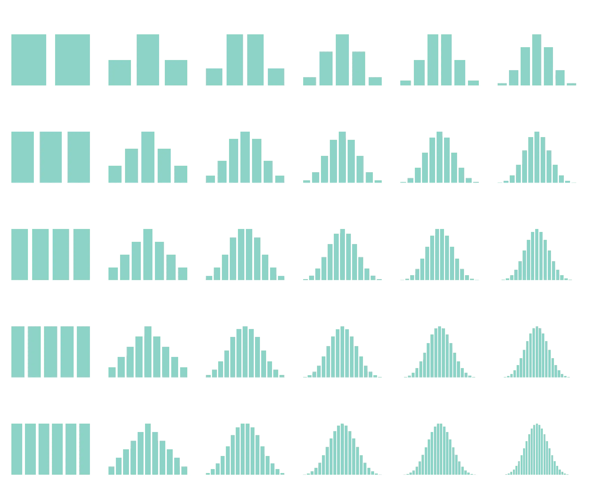
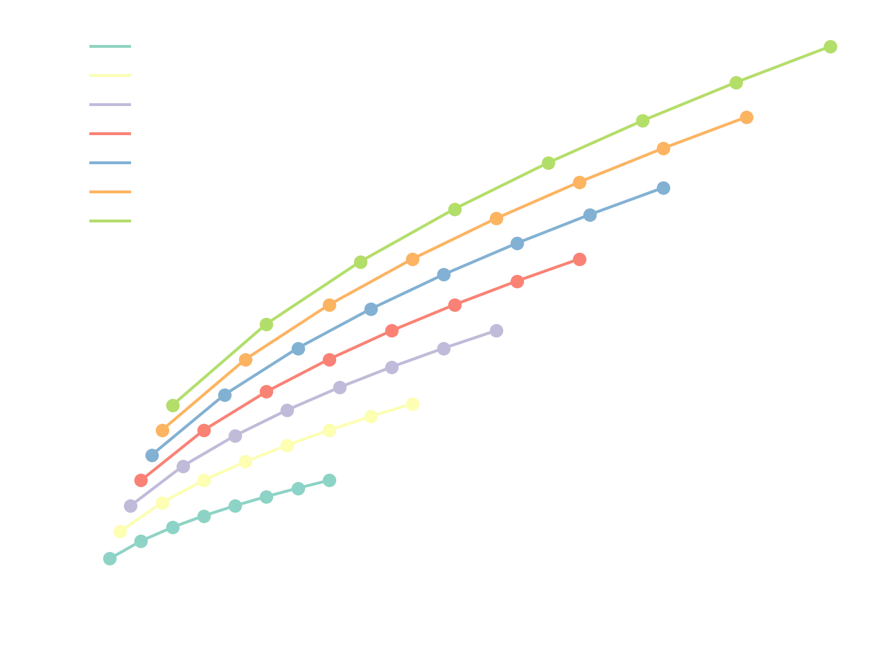
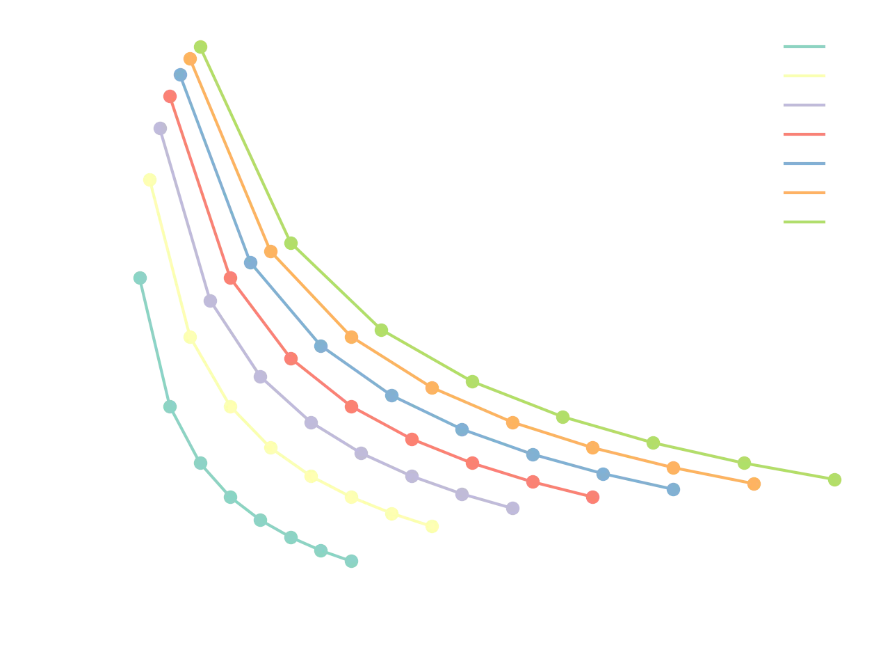
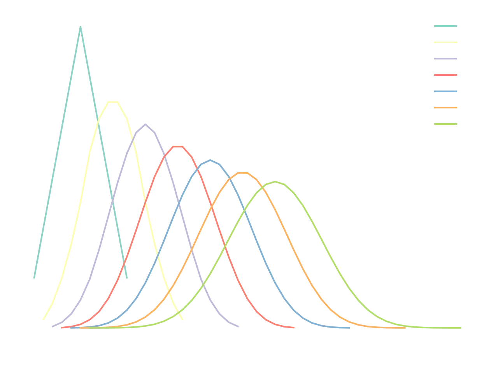
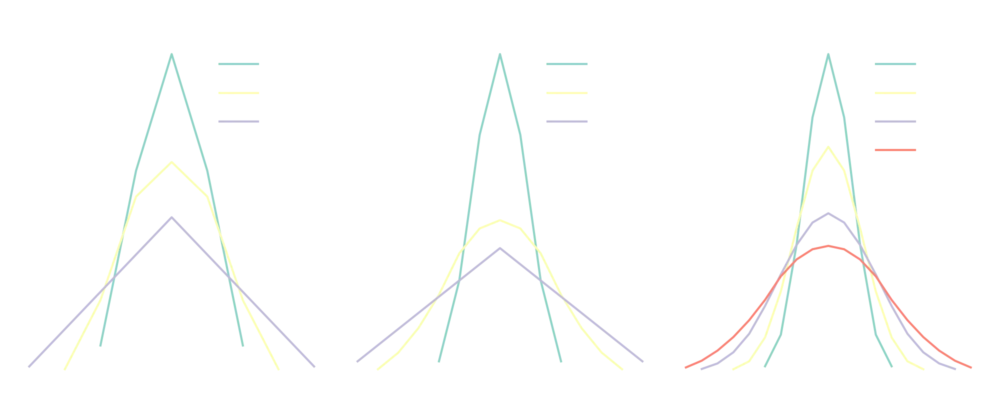

## Introduction

In the Dungeons and Dragons role-playing game, the players make use of various combinations of dice, and their corresponding outcome distributions, to represent the difficulty of an action. For instance, the amount of damage that a player character does to the otherwise peaceful goblin that has been caught by surprise may be decided by *rolling* two 4-sided dice (`2d4`) and adding the results.

I want to explore the distributions that result from these kinds of *rolls*. In particular, I am interested in analyzing how the spread of expected outcomes relates to the number and type of dice.

## Distributions

Let us begin by looking at the distributions produced by different combinations of dice. Here I show an array of histograms, where the number of faces increases across rows, and the number of dice across columns. For a single die (column 1), the distribution is always uniform (any face is equally likely), and the number of possible outcomes increases linearly with the number of sides. The number of combinations (N), the mean of the distribution ($\mu$), and the standard deviation normalized by the mean ($\frac{\sigma}{\mu}$) are shown on top of every histogram.

<figure>
  
  <figcaption>
    Fig. 1: Array of outcome distributions for varying numbers and types of dice. Rows represent dice with 1–6 faces, and columns represent 2–6 dice.
  </figcaption>
</figure>

We can observe that as the number of dice increases (left to right, column-wise), the histograms approach a normal distribution. This is due to the Central Limit Theorem (CLT), which states that the sum (or average) of a large number of independent and identically distributed random variables tends toward a normal distribution, regardless of the original distribution of the individual variables. Since each die throw is independent and identically distributed, the theorem applies directly to the sums considered here.

> **Note**: These distributions are computed exactly using combinatorial methods rather than through random simulation. As the number of dice increases, the number of attainable sums also increases, making the histograms appear progressively smoother. However, the emergence of the Gaussian-like shape is fundamentally a consequence of summing an increasing number of independent random variables, not of the combinatorial enumeration itself.

## Statistical features

How are the mean and spread related? The next figure shows the mean of each distribution versus its standard deviation, color-coded by the number of faces (the number of dice can be inferred from the increasing mean).

<figure>
  
  <figcaption>
    Fig. 2: Relationship between the mean and standard deviation of each dice distribution.
  </figcaption>
</figure>

In Figure 2, we can see that the slope decreases with each added die, which means that the mean of the distribution increases faster than its standard deviation. Another way of looking at this property would be to normalize the standard deviation by dividing it by the mean, as shown in the next plot.

<figure>
  
  <figcaption>
    Fig. 3: Mean versus relative standard deviation ($\frac{\sigma}{\mu}$) for each dice distribution.
  </figcaption>
</figure>

In other words, the *relative standard deviation* decreases with the number of dice! This is further illustrated in the following figure, where the distributions for the sum of an increasing number of 6-sided dice are shown; notice how the relative spread that is gained from the additional dice is progressively smaller.

<figure>
  
  <figcaption>
    Fig. 4: Distributions of sums obtained from rolling increasing numbers of 6-sided dice.
  </figcaption>
</figure>

## Spread versus number of dice

This is all well and good, but what does this mean in practice? Let us now compare distributions with the same mean (vertically-aligned data points in Fig. 2 and Fig. 3). In the next figure, several distributions that share a common mean value are shown, color-coded by the combination of thrown dice (`8d2` means 8 2-faced dice; I guess these would be coins, but you get the idea).

<figure>
  
  <figcaption>
    Fig. 5: Comparison of distributions that have the same mean.
  </figcaption>
</figure>

Notice anything interesting? It would seem that for distributions that share the same mean, the minimum spread is achieved with the maximum number of dice! E.g., if one wants to sample from a distribution of mean=12, one could throw `8d2`, `6d3`, `4d5`, or `3d7`, with `8d2` achieving the minimum spread around the mean. Intuitively, many small random contributions will tend to average out, producing outcomes that cluster tightly around the mean.

## Conclusions

The math involved in this exploration is exceedingly simple, yet its consequences are deep. For one, the DM (Distribution Master) can modulate the risk/reward of a given action in the game by using different distributions. Some players may be enticed by the idea of a high-risk, high-reward action, such as a strong attack that can do a highly variable  amount of damage (very high or very low), and others may prefer consistent output of damage, for a more predictable, but safer, gameplay.

> **Note**: Any implicit association that the author of this post may have drawn between games with randomness mechanics and gambling addiction is purely coincidental (what are the chances?).

The same statistical behaviour appears far beyond the realm of tabletop games. From statistical mechanics, we know that when the number of particles in a system is large, significant deviations from the average value of a given property tend to be rare. In other words, its distribution is sharply centered around the average.

Another way of looking at this is that, as the system size grows, the microscopic randomness averages out, resulting in more predictable and stable macroscopic behavior. This allows us to describe properties of macroscopic matter, such as temperature or pressure, as if they were uniform.

***

Well, there it is, the dumbest way to approach statistical mechanics. I have to admit that when I started working on the post, I was not expecting to connect it to something so interesting.

I would like to write more about statistical mechanics, and I have already begun work on a follow-up post about molecular simulation. If I ever finish it, I will add a link somewhere in this post.

>Mikel: I want to make a conceptual post without much technical background. 
>DM: *rolls 1d20*: 13 
>DM: Since you have a +2 in charisma for being your second post, but also a penalty of -1 for not commenting on the [$\mu \propto n$] and [$\sigma \propto \sqrt{n}$] relationships... 
>DM: *checks notes*: (13 + 2 - 1) >= 10 (standard difficulty) 
>DM: You write an okay post, but it's nothing special 
>Mikel: Nice.

Mikel
