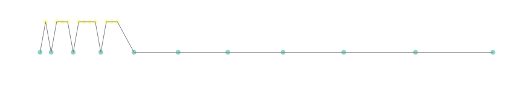
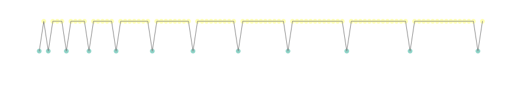

# Introduction

The following is a problem that appears in the book "Gödel, Escher, Bach" by Douglas Hofstadter; it was presented to me without context by a friend (in the book, it illustrates a deeper idea), during a train ride .

> Can you characterize the following set of integers (or its negative space)?
>
> `1 3 7 12 18 26 35 45 56 69`

A logical first step in the analysis of this series would be to compute the differences between the numbers, which are clearly separated by increasingly larger numbers

```
 O     D
---------

 1
    -  2
 3
    -  4
 7
    -  5
12
    -  6
18
    -  8
26
    -  9
35
    -  10
45
    -  11
56
    -  13
69
```

If we represent the problem this way, it is **immediately** evident that the series represented by the differences between numbers (`D`) does not intersect with the original series (`O`). This point is relevant, and constitutes a key regarding the nature of this series (which is why Hofstadter mentions _negative space_ in the formulation of the problem).

Well. When I was shown this problem, I was on a train ride, back from a conference, and I guess my brain was operating in potato mode, because I did not see the problem this way. Instead, what I saw was that the differences between the differences (`DD`) followed a pattern, where most of the times the difference (`D`) is increased by 1, but sometimes by 2, as shown below.

```
O   1  3  7  12  18  26  35   45   56   69
D    2  4  5   6   8   9   10   11   13
DD    2  1  1   2   1   1    1    2
```

This suggested a progression of the differences between differences (`DD`)

```
2 1 1
2 1 1 1
2 1 1 1 1
2 1 1 1 1 1
```

After I had inferred this, another friend pointed out that the `O` and `D` sets do not intersect.

_How interesting!_, I thought. I wondered whether this property (non-intersecting series) could be generally constructed with a pattern of differences composed of `1`s and `2`s. In an effort to check this, I set out to generate...

# A series based on the difference of differences

First, we generate the differences of the differences (`DD`)

```python
def generate_dd(N):
    r_size = 2 # size of repeat; I initialize it just before 2 1 1
    r_left = 0 # how many numbers are left to fill repeat of size r_size
    list_dds = []

    for i in range(N):
        # if it is the end of the repeat:
        if r_left == 0:
            dd = 2           # add a 2 to the list_dds
            r_size += 1      # increase the repeat size
            r_left = r_size  # reset the r_left counter
        else:
            dd = 1           # add a 1 to the list_dds

        list_dds.append(dd)  # update list_dds
        r_left -= 1          # update r_left counter

    return list_dds
```

```python
# the number of numbers to generate
N = 12

list_dds = generate_dd(N)
print(len(list_dds))
print(list_dds)
```

```raw
12
[2, 1, 1, 2, 1, 1, 1, 2, 1, 1, 1, 1]
```

Then, we use the differences between differences (`DD`) to generate a list of differences (`D`)

```python
def generate_diffs(list_dds):
    # we initialize the list with a 2
    temp_list = [2] + list_dds
    list_diffs = np.cumsum(temp_list).tolist()
    return list_diffs
```

```python
list_diffs = generate_diffs(list_dds)
print(len(list_diffs))
print(list_diffs)
```

```raw
13
[2, 4, 5, 6, 8, 9, 10, 11, 13, 14, 15, 16, 17]
```

Finally, we can use the differences to construct the original series (`O`)

```python
def generate_series(list_diffs):
    temp_list = [1] + list_diffs
    list_series = np.cumsum(temp_list).tolist()
    return list_series
```

```python
list_series = generate_series(list_diffs)
print(len(list_series))
print(list_series)
```

```raw
14
[1, 3, 7, 12, 18, 26, 35, 45, 56, 69, 83, 98, 114, 131]
```

Indeed, this looks like the series of numbers that the problem asks us to characterize!

`1 3 7 12 18 26 35 45 56 69`

I thought important to check both that

- a) there are no bugs in the code and each step does correspond to the difference between elements of the next step (functional correctness), and
- b) there is no intersection between members of both series (hypothesis)

```python
# sanity checks (do not let paranoia settle in)
assert np.array_equal(np.array(list_diffs), np.diff(list_series))
assert np.array_equal(np.array(list_dds), np.diff(list_diffs))

# check that, indeed, list_diffs and list_series do not intersect!
set(list_series).intersection(set(list_diffs))
```

```raw
set()
```

Life is good. Math achieved.

But now, let us check that this property holds for a longer stretch of the series!

```python
# the number of numbers to generate
N = 200

list_dds = generate_dd(N)
list_diffs = generate_diffs(list_dds)
list_series = generate_series(list_diffs)
```

```python
# sanity checks (still do not let paranoia settle in)
assert np.array_equal(np.array(list_diffs), np.diff(list_series))
assert np.array_equal(np.array(list_dds), np.diff(list_diffs))

# check that, indeed, list_diffs and list_series do not intersect!
set(list_series).intersection(set(list_diffs))
```

```raw
{26, 35, 45, 56, 69, 83, 98, 114, 131, 170, 191, 213}
```

Gosh darn it. As it turns out, I was wrong about the `2 1 1 2 1 1 1 ...` pattern. After some research on Quora and StackOverflow, I now know that the series is in fact a...

# Hofstadter Figure-Figure sequence

The Hofstadter Figure-Figure (R and S) sequences are a pair of complementary integer sequences defined as follows:

$$R(1) = 1; S(1) = 2$$

$$R(n) = R(n-1) + S(n-1), n > 1$$

where $S(n)$ defined as a strictly increasing series of positive integers not present in $R(n)$

We can thus construct this series from the description, in a step-wise manner

```raw
# step 1 (Initialization)
R 1
S 2

# step 2 (extension of R)
R 1 3
S 2

# step 3 (extension of S)
R 1 3
S 2 4

# goto step 2
R 1 3 7
S 2 4

...
```

Here is a possible implementation

```python
def compute_Hofstadter_sequence(N=10):
    # initialization
    R = [1]
    S = [2]

    # extension
    for i in range(N):
        # extend R
        new_R = R[i] + S[i]
        R.append(new_R)

        # extend S
        candidate_S = S[i] + 1
        while True:
            if candidate_S not in R:
                new_S = candidate_S
                break
            else:
                candidate_S += 1

        S.append(new_S)

    # finalization
    return R, S
```

```python
R, S = compute_Hofstadter_sequence(10)
print(R)
print(S)
```

```raw
[1, 3, 7, 12, 18, 26, 35, 45, 56, 69, 83]
[2, 4, 5, 6, 8, 9, 10, 11, 13, 14, 15]
```

```python
# sanity check (still cannot let paranoia settle in!)
assert np.array_equal(np.diff(R), np.array(S[:-1]))

# check that, the R and S sets do not intersect!
set(R).intersection(set(S))
```

```raw
set()
```

And, finally, we will check that this property holds for larger segments of these sets

```python
R, S = compute_Hofstadter_sequence(10000)
```

```python
# we can check that, the R and S sets do not intersect!
set(R).intersection(set(S))
```

```raw
set()
```

## Visualization

Now that we understand how the sequence is constructed, let us visualize it

```python
R, S = compute_Hofstadter_sequence(10)
```

```python
# create indices to remember which set each value came from
mat_R = np.vstack((R, np.zeros_like(R))).T
mat_S = np.vstack((S, np.ones_like(R))).T
# stack the two matrices
mat_data = np.vstack([mat_R, mat_S])

print(mat_R.shape)
print(mat_S.shape)
print(mat_data.shape)
```

```raw
(11, 2)
(11, 2)
(22, 2)
```

```python
# sort them by value
mat_sorting_mask = np.argsort(mat_data[:,0])
sorted_mat_data = mat_data[mat_sorting_mask]
print(sorted_mat_data[:10,:])
```

```raw
array([[ 1,  0],
        [ 2,  1],
        [ 3,  0],
        [ 4,  1],
        [ 5,  1],
        [ 6,  1],
        [ 7,  0],
        [ 8,  1],
        [ 9,  1],
        [10,  1]])
```

<figure>
  
</figure>

This looks significantly less cool than what I anticipated... Ah, of course, we need a higher quantity of numbers in S to properly populate the figure! Note that, even though both series grow at equal speed in terms of number of members, in terms of value, the elements of R grow much faster (check the figure above).

```python
R, S = compute_Hofstadter_sequence(1000)
```

```python
# create indices to remember which set each value came from
mat_R = np.vstack((R, np.zeros_like(R))).T
mat_S = np.vstack((S, np.ones_like(R))).T
# stack the two matrices
mat_data = np.vstack([mat_R, mat_S])

print(mat_R.shape)
print(mat_S.shape)
print(mat_data.shape)
```

```raw
(1001, 2)
(1001, 2)
(2002, 2)
```

```python
# sort them by value
mat_sorting_mask = np.argsort(mat_data[:,0])
sorted_mat_data = mat_data[mat_sorting_mask]

# only keep values under a threshold
sorted_mat_data = sorted_mat_data[sorted_mat_data[:,0] < 100]
```

<figure>
  
</figure>

Would you look at that. It would seem that the `2 1 1 1` pattern emerges once again; instead of in the second-degree differences (differences of differences), it is found in the set to which consecutive numbers belong (R=2, S=1). The ghost of shadow series' past, to torment me, no doubt.

```python
# map the 0-1 values to to 2-1, and remove two initial members
list_21_pattern = (1-sorted_mat_data[:,1]+1).tolist()[2:]
print(list_21_pattern)
```

```raw
[2, 1, 1, 1, 2, 1, 1, 1, 1, 2, 1, 1, 1, 1, 1, 2, 1, 1, 1, 1, 1, 1, 1
```

```python
# visualize the pattern
str_21_pattern = ''.join(f"\n2 " if val == 2
                         else "1 "
                         for val in list_21_pattern)
print(str_21_pattern)
```

```
2 1 1 1
2 1 1 1 1
2 1 1 1 1 1
2 1 1 1 1 1 1 1
2 1 1 1 1 1 1 1 1
2 1 1 1 1 1 1 1 1 1
2 1 1 1 1 1 1 1 1 1 1
2 1 1 1 1 1 1 1 1 1 1 1 1
2 1 1 1 1 1 1 1 1 1 1 1 1 1
2 1 1 1 1 1 1 1 1 1 1 1 1 1 1
```

Do I see another pattern emerging? Let us generate a larger representation of the series

```python
R, S = compute_Hofstadter_sequence(1000)

mat_R = np.vstack((R, np.zeros_like(R))).T
mat_S = np.vstack((S, np.ones_like(R))).T
mat_data = np.vstack([mat_R, mat_S])
mat_sorting_mask = np.argsort(mat_data[:,0])
sorted_mat_data = mat_data[mat_sorting_mask]
sorted_mat_data = sorted_mat_data[sorted_mat_data[:,0] < 900]
```

```python
list_21_pattern = (1-sorted_mat_data[:,1]+1).tolist()[2:]

str_21_pattern = ''.join(f"\n2 " if val == 2
                         else "1 "
                         for val in list_21_pattern)
print(str_21_pattern)
```

```
2 1 1 1
2 1 1 1 1
2 1 1 1 1 1
2 1 1 1 1 1 1 1
2 1 1 1 1 1 1 1 1
2 1 1 1 1 1 1 1 1 1
2 1 1 1 1 1 1 1 1 1 1
2 1 1 1 1 1 1 1 1 1 1 1 1
2 1 1 1 1 1 1 1 1 1 1 1 1 1
2 1 1 1 1 1 1 1 1 1 1 1 1 1 1
2 1 1 1 1 1 1 1 1 1 1 1 1 1 1 1
2 1 1 1 1 1 1 1 1 1 1 1 1 1 1 1 1
2 1 1 1 1 1 1 1 1 1 1 1 1 1 1 1 1 1 1
2 1 1 1 1 1 1 1 1 1 1 1 1 1 1 1 1 1 1 1
2 1 1 1 1 1 1 1 1 1 1 1 1 1 1 1 1 1 1 1 1
2 1 1 1 1 1 1 1 1 1 1 1 1 1 1 1 1 1 1 1 1 1
2 1 1 1 1 1 1 1 1 1 1 1 1 1 1 1 1 1 1 1 1 1 1
2 1 1 1 1 1 1 1 1 1 1 1 1 1 1 1 1 1 1 1 1 1 1 1
2 1 1 1 1 1 1 1 1 1 1 1 1 1 1 1 1 1 1 1 1 1 1 1 1
2 1 1 1 1 1 1 1 1 1 1 1 1 1 1 1 1 1 1 1 1 1 1 1 1 1 1
2 1 1 1 1 1 1 1 1 1 1 1 1 1 1 1 1 1 1 1 1 1 1 1 1 1 1 1
2 1 1 1 1 1 1 1 1 1 1 1 1 1 1 1 1 1 1 1 1 1 1 1 1 1 1 1 1
2 1 1 1 1 1 1 1 1 1 1 1 1 1 1 1 1 1 1 1 1 1 1 1 1 1 1 1 1 1
2 1 1 1 1 1 1 1 1 1 1 1 1 1 1 1 1 1 1 1 1 1 1 1 1 1 1 1 1 1 1
2 1 1 1 1 1 1 1 1 1 1 1 1 1 1 1 1 1 1 1 1 1 1 1 1 1 1 1 1 1 1 1
2 1 1 1 1 1 1 1 1 1 1 1 1 1 1 1 1 1 1 1 1 1 1 1 1 1 1 1 1 1 1 1 1
2 1 1 1 1 1 1 1 1 1 1 1 1 1 1 1 1 1 1 1 1 1 1 1 1 1 1 1 1 1 1 1 1 1
2 1 1 1 1 1 1 1 1 1 1 1 1 1 1 1 1 1 1 1 1 1 1 1 1 1 1 1 1 1 1 1 1 1 1 1
2 1 1 1 1 1 1 1 1 1 1 1 1 1 1 1 1 1 1 1 1 1 1 1 1 1 1 1 1 1 1 1 1 1 1 1 1
2 1 1 1 1 1 1 1 1 1 1 1 1 1 1 1 1 1 1 1 1 1 1 1 1 1 1 1 1 1 1 1 1 1 1 1 1 1
2 1 1 1 1 1 1 1 1 1 1 1 1 1 1 1 1 1 1 1 1 1 1 1 1 1 1 1 1 1 1 1 1 1 1 1 1 1 1
2 1 1 1 1 1 1 1 1 1 1 1 1 1 1 1 1 1 1 1 1 1 1 1 1 1 1 1 1 1 1 1 1 1 1 1 1 1 1 1
```

The pattern start with `2 1 1` as a base block

For 3 rounds, the pattern adds `1`, and then `11`

For 4 rounds, the pattern adds `1`, and then `11`

For 5 rounds, the pattern adds `1` and then `11`

Then... then it skips to 7 rounds, not 6.

<details>
<summary>Oh well.</summary>


</details>

# Conclusions

This was fun. Even though my initial motivation to develop this notebook was rooted in a wrong premise, I think the exercise was useful.

For the sake of the argument, one could make a philosophical point about the fact that if someone asks

> Can you characterize the following set of integers (or its negative space)?
>
> `1 3 7 12 18 26 35 45 56 69`

there are multiple correct answers, and, from a certain point of view, I was not wrong, but rather, I was fed incomplete data!

I am not salty at all, even though I will mention, in no way to defend myself, that, from my research, several people on the internet had the same idea as I. Just saying.

Screw you Douglas Hofstadter, I cannot wait to read "Gödel, Escher, Bach".

---

The post above was adapted from a draft I worked on in the summer of 2024. In retrospect, I approached the problem quite naively, and I am not surprised that I did not arrive at the correct solution on my own. What fascinated me was that three different people could look at the same problem and arrive at completely different interpretations, all of which were compatible with the limited information provided; this was my main motivation for revisiting the draft.

An additional reason to work on this post was to test and customize code representation, which I need for some ideas I am working on. Once I have polished my content pipeline further, I would like to write a tutorial post describing my setup, so it may help others who are looking to start writing their own blog.

As a short _where are they now?_, I am happy to say that my friends gifted me the "Gödel, Escher, Bach" by Douglas Hofstadter at the end of 2024, which I thought was in great taste, and that still, I am looking forward to read it. I suspect that, like most people who read it, I will not be able to fully grasp its value, and I am fine with it. Also, as an amusing coincidence (?), the Figure-Figure sequence appears on page `69` of the book, because of course it does (69 is the 10th member of the sequence from the original problem).

Mikel
