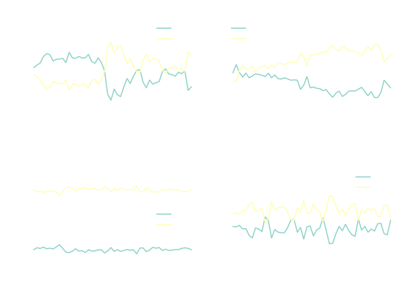
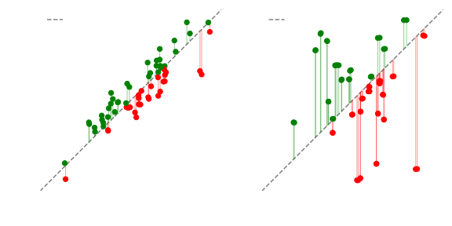
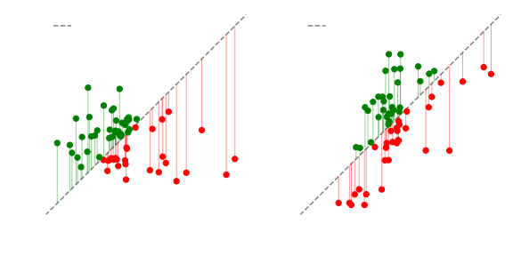
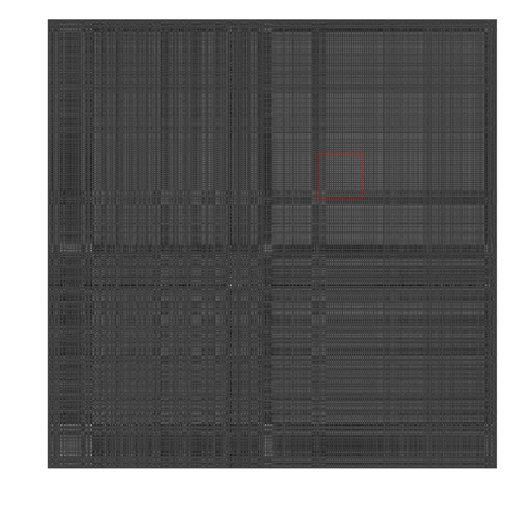
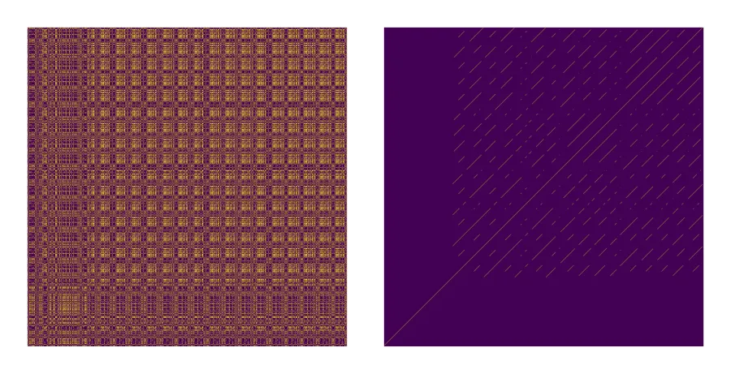
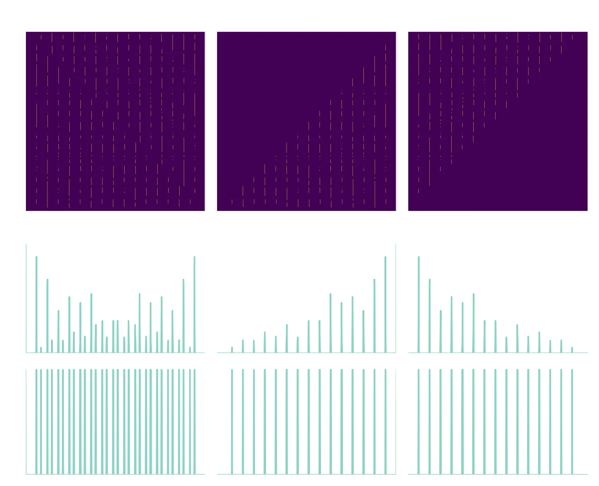
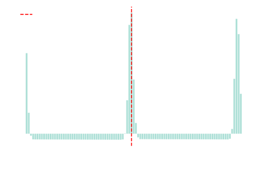
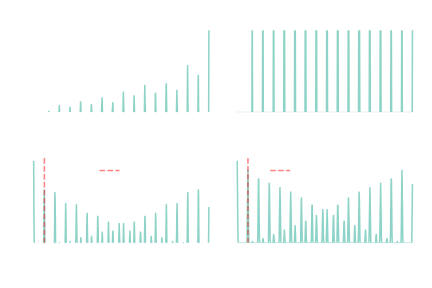

## Introduction

We have a _relatively_ good model for how life works. Roughly:

- **Cells** are the minimal units of life (viruses can be defined as cell-less organisms)
- **Genomic** material inside cells stores information on **genes** and their regulation (when, where, and how much to express them)
- The expression products of genes are mainly **proteins** and **regulatory DNA and RNA molecules**
- The products of genes interact between them and with other molecules, such as lipids or saccharides, in a process known as **cellular metabolism**; this broadly includes transformation of energy, synthesis of new chemical compounds, and regulation of cell cycle (when and if cells change, duplicate, or die).

Although scientific research operates at all these levels in pursuit of a holistic understanding of life, in this post my goals are more humble. I would like to provide a glimpse of the kind of work that pertains to **bioinformatics**, the field devoted to the application of computational techniques to the analysis of biological information. Some of its applications include:

- Comparing the genomes of organisms to infer an evolutionary tree
- Predicting the function of specific parts of a genome
- Translating functional evidence from one organism to another based on their similarity

Here, I would like to derive various measurements of the structure of the genomes. In other words, **in how many ways are genomes not random?**

## The structure of genomes

Most somatic human cells store their DNA packaged in two pairs of 23 chromosomes, which are located within the cell _nucleus_. The number of copies, as well as the number of chromosomes, varies across the tree of life. More primitive forms of life, such as bacteria, lack such sophisticated organization, or even a nuclear structure, and instead have their genomic sequence, _just floating around_. In a related fashion, genomic regulation (when and where to express particular genes) is vastly more complex in nucleated cells (eukaryotes) than in those without nuclei (prokaryotes).

DNA molecules consist of unbranched chains of nucleotides (two chains are required to form the double-helix structure); these nucleotides can be one of four, Adenosine (A), Thymine (T), Cytosine (C) and Guanine (G). The way that DNA encodes proteins is by mapping triplets of nucleotides into amino acids. Proteins consist of unbranched chains of amino acid residues, which fold into complex shapes with functional properties, such as catalyzing chemical reactions (enzymes) or providing structural support (collagen).

How does the mapping from DNA to protein work? Each **coding** nucleotide triplet, also called a **codon**, en**codes** a symbol in the protein message. The message can correspond to `<START_PROTEIN>`, `<INSERT_AMINOACID>`, and `<END_PROTEIN>`. The ribosome is the molecular machine that reads the start and end codons and takes care of inserting the correct amino acids in the protein chain. Each possible amino acid residue is encoded by **more than one** codon; this is necessary, since there are $4^3=64$ possible codons, but only 20 proteinogenic amino acids.

If the "encoding" units of the genome are triplets, it cannot be random, right? It necessitates of a **structure**. How can we detect it? There are many mathematical models that can help us make sense of biological sequence data. Some of them are widely used in unrelated domains such as data compression or time series prediction. Here, we will develop a series of basic models to show that there are multiple levels of structure in genomes, and briefly discuss their implications.

## A measure of bias

Let us first consider genome composition. At this level of structure, we will only examine the enrichment of ATCG in genomes. We will illustrate this with a bunch of arbitrarily chosen organisms. Let us introduce the characters of the drama:

- Bacteriophage (or just phage) $\lambda$ is a virus which preys on bacteria, hence the name. Their "life" cycle consists of infecting bacteria by injecting their DNA, effectively hijacking the cell machinery to synthesize more phages. Eventually, the bacteria bursts open, releasing newly assembled phages which will infect other bacteria.
- Escherichia coli is a gram-negative rod-shaped bacterium, typically found in the human gut. It is of particular interest regarding human health, as it is often associated with food and water contamination. It is the most studied bacterium, as well as the favourite prey of the bacteriophage $\lambda$. This is not a matter of taste, but rather an artifact of millions of years of co-evolution.
- Staphylococcus aureus is a gram-positive bacterium which grows as clusters (greek: σταφυλή, staphylḗ) of spherical cells (latin: coccus, of greek source). Although typically it can be found as an innocuous guest in the human body, under some conditions, such as deficient immunological function, it can become a dangerous and possibly lethal pathogen.
- Homo sapiens (_sapiens_) is the only organism known to produce personal blogs, although their quality and reliability vary considerably. Together with chimpanzees and bonobos, they are classified under the _Homininae_ subfamily (not to be confused with _Hominoidea_, _Hominidae_, _Homininae_, _Hominina_, nor _Homo_ (really, don't).
- Mitochondria are the powerhouse of the cell. They are not proper "organisms", but rather, _organelles_, structural and functional elements inside living cells. Crucially, they have their own, specialized and limited genome, different (and how!) from their parental cells. At a distant point in the past they likely were free-living prokaryotes, which embraced the benefits of migrating inside another cell, specializing in chemical energy metabolism and losing the ability to live independently (endosymbiosis).

Below I show the relative proportion of each nucleotide in the genome of each of the chosen organisms. We refer to this as a form of _global_ bias, since the computation is done on the entire genome of each organism; for _H. sapiens_ I only used chromosome 1 in order to avoid having to download the entire genome.

```bash
Bacteriophage_Lambda
A: 25.4%  T: 24.7%  C: 23.4%  G: 26.4%

Escherichia_coli
A: 24.6%  T: 24.6%  C: 25.4%  G: 25.4%

Staphylococcus_aureus
A: 33.3%  T: 33.9%  C: 16.5%  G: 16.4%

Homo_sapiens_mit.
A: 30.9%  T: 24.7%  C: 31.3%  G: 13.2%

Homo_sapiens_Chr._1
A: 25.7%  T: 25.7%  C: 23.9%  G: 23.9%
```

Even with such brute calculation, we see glimpses of structure. Firstly, the proportions of nucleotides vary quite a lot between organisms. Secondly, for most of these organisms, there seems to be some sort of entanglement between the proportions of A and T, and likewise between C and G. Although this may be reminiscent of A-T and C-G complementarity in the native, folded DNA double-helix, the sequence from which these metrics were calculated is a single strand, so base pairing does not explain it (in fact, the mitochondrial genome ~~does not give a shit~~ does not show A $\approx$ T and C $\approx$ G).

This seems to be an example of Chargaff's _second parity rule_, which states that this kind of pairing is typical of sufficiently long **single** DNA strands. As far as I understand, there is no scientific consensus regarding the mechanisms that shape this empirical observation. To the interested reader I refer to specialized literature, particularly to the work of [Forsdyke](https://pmc.ncbi.nlm.nih.gov/articles/PMC8057000) and [Rosandić et al.](https://pmc.ncbi.nlm.nih.gov/articles/PMC9689577). Disclaimer: I am in no way affiliated with these people, whose work I just discovered, and the contents of this post do not support, deny, or are otherwise inspired by these papers.

Let us now move ever so slightly from **global** biases in nucleotide composition to more **local**ized features. How does nucleotide enrichment look **along the genome**? Below we compute the AT/GC ratios for 50 windows of the reference genomes (since they must sum to 1, they are complementary).

<figure>
  
  <figcaption>
    GC / AT content throughout the genome of representative organisms.
  </figcaption>
</figure>

Even more structure emerges. Notice the difference in scales. While the phage and mitochondria have genomes in the ballpark of $10^4$ nucleotides, bacteria feature genomes 100 times longer, and humans 10 times more than that (more generally, there is a **loose** relationship between genomic length and organism complexity, but there are exceptions to this). There are also significant differences in the patterns that each organism shows. For instance, phages have alternating AT- or GC- enriched segments, chromosome 1 of _Homo sapiens_ progressively increases the ratio of $\frac{\text{A+T}}{\text{G+C}}$ from the start to the end, and _S. aureus_ is markedly stable along the genome, although predominantly AT-rich.

## We are expecting (triplets)

In the background section I alluded to codons, protein-encoding nucleotide triplets. Proteins being the fundamental molecular machines of life, one would expect some structure to exist at the level of _k-mers_ (the _k_ standing for the length, such as 2-mer or 3-mer). There are many features that we could implement, but to keep things simple, I have chosen to simply compute the odds ratio between _observed_ and _expected_ triplet frequencies. This model assumes a background random distribution given by

$$P(\text{XYZ}) = P(\text{X}) \times P(\text{Y}) \times P(\text{Z})$$

where $P(\text{X})$ is the ratio of X in the genome. Arguably, this is a very _naive_ way of looking at enriched or disfavoured triplets, but it is precisely the lack of assumptions that makes it so generally applicable. Consider, as an example, the top 5 most and least enriched triplets in the genome of human mitochondria.

| kmer | counts |       prob | expected | odds_ratio |
| :--- | -----: | ---------: | -------: | ---------: |
| AGG  |    175 | 0.00538402 |  89.2078 |    1.96171 |
| GGG  |     72 | 0.00229997 |  38.1082 |    1.88936 |
| GGC  |    152 | 0.00545371 |  90.3626 |    1.68211 |
| TAG  |    259 |  0.0100746 |  166.927 |    1.55158 |
| GAG  |    131 | 0.00538402 |  89.2078 |    1.46848 |

| kmer | counts |       prob | expected | odds_ratio |
| :--- | -----: | ---------: | -------: | ---------: |
| GTC  |    107 |  0.0102051 |  169.088 |   0.632808 |
| GCG  |     56 | 0.00545371 |  90.3626 |   0.619726 |
| CGA  |    124 |  0.0127666 |  211.531 |   0.586204 |
| ACG  |    120 |  0.0127666 |  211.531 |   0.567294 |
| CGT  |     78 |  0.0102051 |  169.088 |     0.4613 |

The most represented triplet (highest odds ratio) is `AGG`, found nearly twice as often as we would expect from the random background model. According to the [mitochondrial genetic code](https://en.wikipedia.org/wiki/Vertebrate_mitochondrial_code), this is a stop codon, the triplet that signals to the ribosome that the protein synthesis should stop. `TAG`, which is also quite overrepresented, is a stop codon as well. Both `GGG` and `GGC` are glycine-encoding triplets, although `GGG` is less commonly used, likely due to the abundance of C in the mitochondrial genome compared to G (check previous section); this is probably related to `GGG` being more overrepresented than `GGC` in the odds ratio table above.

On the other hand, we have triplets which are found less often than in the background random model. Both `CGT` and `CGA` encode for arginine, a relatively uncommon amino acid (hence their low odds ratio). We also find `ACG` and `GCG`, the [rarest](https://academic.oup.com/mbe/article/25/2/339/1132544) threonine- and alanine-encoding codons respectively.

The running theme with the triplet enrichment analysis in mitochondria is that most of the signal seems to stem from **coding triplets**, or codons. This is not a coincidence. Depending on the organism, genomes range from mostly protein-coding (such as, you guessed it, mitochondria!), to barely coding (only a meager 2% of the human genome consists of genes; the rest is filled with regulatory material as well as genomic _junk_). Because of this, besides mitochondria, none of the other reference genomes can be connected via triplet analysis to codon usage (check the notebook).

Is then triplet enrichment analysis useless? Ye of little faith. Even though the individual triplet enrichment cannot be reliably connected to codon usage, we can still compare genomes to each other via their relative enrichment of triplets (even though the signal may not stem from codon usage, in the case of primarily non-coding genomes).

For example, consider the comparison of triplet enrichment between bacteriophage $\lambda$ and _E. coli_. They are strikingly similar! How can this be? It is almost as if there is some **natural** process which has **selected** them to be similar... But what would that process be? Likely, it is the fact that, since the phage has to hijack the cellular machinery of _E. coli_ to replicate and infect other bacteria, having genomic features similar to those of its host (such as codon usage) improves the efficiency of this process.

Contrast this to the comparison between _E. coli_ and human chromosome 1. Clearly, the dissimilarity in terms of triplet enrichment is larger; indeed, we have no reason to expect these to be similar.

<figure>
  
  <figcaption>
    Comparison between triplet enrichment in the genomes: (left) bacteriophage $\lambda$ vs *E. coli*; (right) human chromosome 1 vs *E. coli*.
  </figcaption>
</figure>

A particularly interesting trend arises when comparing the triplet usage of reference genomes with that of mitochondria. The clustering of red nodes towards the right side of the plot represents that, generally, the triplets which are **over**represented in mitochondrial genomes are **under**represented in other organisms.

<figure>
  
  <figcaption>
    Comparison between triplet enrichment in genomes: (left) *S. aureus* vs human mitochondria; (right) human chromosome 1 vs human mitochondria.
  </figcaption>
</figure>

This phenomenon could be linked, as we have outlined before, to the fact that the mitochondrial triplet usage is largely influenced by its codon usage, since it has a mostly protein-encoding genome; if this were the reason for the trend, however, the same pattern would not show up when comparing mitochondria to _S. aureus_, which features a roughly 85% coding genome. I have no idea what is going on, but this will be left open for future pondering (please do not take evolutionary advice from me).

## Repetitive business

In this last section, I would like to explore another source of structure which is near and dear to my heart: repetitions.

Repeats are found throughout biology. Our very own bodies are formed by repeats: the segments of our fingers and limbs, the ribs that protect our fleshy delicate parts, the teeth with which we destroy other organism's delicate parts, the vertebrae which form the backbone, the long myosin fibers that form our muscle fibers...

Repeats, paraphrasing Karis Nemik in Andor, "are a pure idea. They occur spontaneously and without instruction". Some of the most primitive arthropods have many repeating body segments, such as scorpions, a far cry of a distant moment of quick evolutionary innovation, known as the _Cambrian explosion_, which took place roughly 539 million years ago. During this diversification event, the rapid innovation of animal body plans gave rise to most of the types of animals we recognize today, possibly facilitated by the reuse of repetitive body segments. Repeats, naturally, are also found throughout genomes.

Let us find ourselves some repeats. I have manually checked the genomic sequence of human chromosome 1, and I have found the 130000-140000 (nucleotides) region particularly interesting. We can represent a sequence as a dotplot, where we project a self-vs-self comparison of the sequence into an NxN matrix. Visual inspection of such dotplot can reveal repeating elements in the structure.

<figure>
  
  <figcaption>
  Matrix representing a dotplot of the 130000-140000 region of human chromosome 1.
  </figcaption>
</figure>

Let us now focus on the sub-section 6000-7000 (+130000). The dotplot below features a repetitive checkerboard pattern, which is evidence of a subsegment of the sequence fitting several parts of the full sequence; in other words, a repetitive segment. To characterize it, we need to determine the length of the repeats, and align them if they are not of the same size.

We can detect repetitive segments by computing a simple matrix convolution on the dotplot, akin to an image "diagonal edge detection" filter.

<figure>
  
  <figcaption>
    Dotplot of the repetitive segment (left) and detection of diagonal features (right)
  </figcaption>
</figure>

The diagonals represent that two positions of the sequences, separated by an offset (repeat length), are the same. Conversely, the distance between the parallel diagonals represents the length of the repeats.

There are various ways of computing this distance, the simplest of which being opening up the image in a viewer, zooming until we can see the individual pixels, and counting how many are between diagonals. This is easy if all the repeats are the exact same size, but during biological evolution, genomic material typically undergoes insertions and deletions (indels), offsetting the distance between the repeats.

We will explore two complementary methods. First, we need to somehow transform the signal from the 2D matrix diagonal into a 1D vector. A rough solution is to offset each row by a factor which depends on the row number. As we "wrap around" (periodic boundaries) each row, this will create an offset along the diagonal, which stems from the fact that the size of the repeats is not a factor of length of the rows. To get a clean signal, we can simply separate this _verticalized_ 2D matrix into the lower and upper diagonals, as shown below.

<figure>
  
  <figcaption>
    Data transformations to obtain 1D signal vector.
  </figcaption>
</figure>

The binary filter makes it easier to see that both diagonals contain peaks at regular intervals. Now, to detect the distance between peaks.

**Approach 1**: Directly compute the _naive_ autocorrelation function (lagged dot product) for a range of possible lag (spacing) values, expecting that the strongest autocorrelation score will correspond with the most dominant periodicity.

$$\hat{P} = \underset{p}{\arg\max}\; C(p), \; \text{where} \; C(p) = \sum_{t=1}^{T-p-1} x_0(t) \times x_0(t+p)$$

<figure>
  
  <figcaption>
  </figcaption>
</figure>

Note that there is some signal with **very** short repeats (1-3), as well as double the maximum (98). Note, also, that there is somewhat of a distribution of high scores around the maximum. This suggests that the _true_ periodicity is somewhere _around_ 49 residues, but there are deviations (likely, corresponding to genomic indels).

**Approach 2**: Indirectly compute a circular autocorrelation function by using a highly optimized fast Fourier Transform (FFT) implementation. Although conceptually very similar to the previous approach, in practical terms it can look a bit messy due to the extra terms that appear as (A) a consequence of the _imperfect_ repeats as well as (B) the fact that the length of the sequence is not a multiple of the repeat size (edge effects).

$$\hat{P} = \underset{p}{\arg\max}\; C(p), \; \text{where} \; C(p) = \sum_{t=1}^{T-1} x_0(t) \times x_0((t+p) \bmod{T})$$

<figure>
  
  <figcaption>
    Fourier transforms of the raw and binary signals.
  </figcaption>
</figure>

Whichever way we cut it, the data suggests that the strongest periodicity is 49. In actuality, we can interactively adjust the alignment to show that although the repeats are predominantly 49-residue long, some have deletions which lowers the average periodicity to $\approx$ 48.7.

```bash
>NC_000001.11 [Homo sapiens] Chr 1:136000-13700
TCTTCAGACCCACATCCCTTCTCCCAGTGACTGAACAGTCCCAGCTCCGGCTGGAGAAGG
GTGTCTGCAGACCCCGCTGTTGCCTCCCAGGGGAGTCTCCAGGCCCAGCTCTCGCCCCAC
CGCGACCTCCCAGGCCCAAGTCCCTGCCTACCTCCCAGCAGCCCGAGTGCGATCCTGTTC
CTCCCTCACGGTGGCCTGTTGAGGCAGGGGGTCACGCTGACCTCTGTCCGCGTGGGA
GGGGCCGGTGTGAGGCAAGGG-CTCACACTGACCTCTCTCAGCGTGGGA
GGGGCCGGTGTGAGGCAAGGGGCTCACGCTGACCTCTGTCCGCGTGGGA
GGGGCCGGTGTGAGGCAAGGG-CTCACACTGACCTCTCTCAGCGTGGGA
GGGGCCGGTGTGAGGCAAGGGGCTCACGCTGACCTCTGTCCGCGTGGGA
GGGGCTGGTGTGAGGCAAGGG-CTCAGGCTGACCTCTCTCAGCGTGGGA
GGGGCCGGTGTGAGGCAAGGGGCTCACGCTGACCTCTGTCCGCGTGGGA
GGGGCCGGTGTGAGACAAGGGGCTCACACTGACCTCTCTCAGCGTGGGA
GGGGCCGGTGTGAGGCAAGGGGCTCAGGCTGACCTCTGTCCGCGTGGGA
GGGGCCGGTGTGAGGCAAGGGGCTCAGGCTGACCTCTGTCCGCGTGGGA
GGGGCCGGTGTGAGGCAAGGGGCTCAGGCTGACCTCTGTCCGCGTGGGA
GGGGCCGGGGTGAGGCAAGGG-CTCACACTGACCTCTCTCAGCGTGGGA
GGGGCCGGTGTGAGGCAAGGGGCTCGGGCTGACCTCTCTCAGCGTGGGA
GGGGCCGGTGTGAGGCAAGGGGCTCGGGCTGACCTCTCTCAGCGTGGGA
GGGGCCGGTGTGAGGCAAGGGGCTCGGGCTGACCTCTGTCCGCGTGGGA
GGGGCCGGTGTGAGGCAAGGGGCTCGGGCTGACCTCTCTCAGCGTGGGA
```

Here are our repeats! Besides the "missing" nucleotides, even though most columns are identical, there are some differences here and there (mutations). This is a classic example of how repeats evolve: an initial amplification (a particular segment is amplified any number of times) followed by mutation and loss of sequence symmetry (similarity between repeats).

How did these repeats originate? Many such repeats are spread throughout genomes as a consequence of innocuous replication errors or the action of some viruses. We refer to these as innocuous because, typically, mutations in regulatory, and especially in (protein) coding DNA, are pathologic or even lethal, which means they can rarely be integrated into the genetic pool.

Likewise, although much of the human genetic material does not serve any particular function, slow generation times (especially in this economy) mean that these _unnecessary_ features are just impossible to be purged from the genome, and thus are slowly accumulated.

Searching for this sequence in genomic databases with `BLAST` shows that it can be found only in members of the _Hominidae_ (primates) group, such as humans, obviously, but also _Pan_ (chimpanzees), _Gorilla_ (gorillas) and _Pongo_ (orangutans).

| Taxon                                                                         | Category |   Count | Hits | Description                  |
| ----------------------------------------------------------------------------- | -------- | ------: | ---: | ---------------------------- |
| **root**                                                                      | —        | **504** |    — | —                            |
| └── **Hominidae**                                                             | primates |     498 |    — | —                            |
| &nbsp;&nbsp;&nbsp;&nbsp;├── _Pongo pygmaeus_                                  | primates |     223 |    1 | Pongo pygmaeus hits          |
| &nbsp;&nbsp;&nbsp;&nbsp;├── _Pongo abelii_                                    | primates |     218 |    2 | Pongo abelii hits            |
| &nbsp;&nbsp;&nbsp;&nbsp;└── **Homininae**                                     | primates |     495 |    — | —                            |
| &nbsp;&nbsp;&nbsp;&nbsp;&nbsp;&nbsp;&nbsp;&nbsp;├── _Homo sapiens_            | primates |    1802 |  102 | Homo sapiens hits            |
| &nbsp;&nbsp;&nbsp;&nbsp;&nbsp;&nbsp;&nbsp;&nbsp;├── _Pan paniscus_            | primates |    1500 |   26 | Pan paniscus hits            |
| &nbsp;&nbsp;&nbsp;&nbsp;&nbsp;&nbsp;&nbsp;&nbsp;├── _Gorilla gorilla gorilla_ | primates |    1490 |  276 | Gorilla gorilla gorilla hits |
| &nbsp;&nbsp;&nbsp;&nbsp;&nbsp;&nbsp;&nbsp;&nbsp;├── _Pan troglodytes_         | primates |    1467 |   84 | Pan troglodytes hits         |
| &nbsp;&nbsp;&nbsp;&nbsp;&nbsp;&nbsp;&nbsp;&nbsp;└── _Gorilla gorilla_         | primates |    1433 |    7 | Gorilla gorilla hits         |

This repetitive sequence is unlikely to be coding for a protein, since it does not have any reasonable open reading frames. Given its taxonomic distribution, it would not be too far-fetched to hypothesize that the sequence was duplicated before the _Homininae_ branched out of the _Hominidae_. It has been laying in all our genomes, waiting to be discovered and annotated, perhaps, a secret token of ancestry with our hairier brethren. Truly, _apes, together, strong_.

## Conclusions

In the previous sections we have touched upon a number of ways in which structure arises in biological genomes. We have explored how global and local biases in nucleotide composition vary between organisms. Then, we have extended this analysis to nucleotide triplets, comparing the distribution of observed against a random background model. Finally, we have applied some basic signal processing methods to detect repetitive sequences in genomes.

There is much more that we could have done, both in terms of width, such as including more genomes and analyses, as well as depth, in terms of exploring each observation in more detail. For example, a fitting extension could have been to perform the triplet analysis only on coding DNA, but this would have required some non-trivial dataset wrangling, and I wanted to have as much a simple initial dataset as possible.

There is much biological background that I have omitted. Biology is the science of exceptions, and I have had to remove many "typically" words from the initial draft, together with unsolicited explanations in parentheses. Some parts I have had to keep vague, such as **why** repeats are so prevalent in nature. The short answer is that, in general, it is easier to copy and adapt than to reinvent, and biological evolution tends to favour the reuse of material.

I hope that you find this exploratory analysis interesting. My goal was to illustrate some of the ways in which biological sequences, particularly genomes, are structured, and in that regard I think these are useful examples. I am very happy with how much I have learned while writing this, which is perhaps the most desirable outcome of such effort.

---

This one took longer than I expected. I always think "this will take a couple of evenings, tops" but then I find interesting extensions to what I am doing. Also, I feel it derailed a bit from the (original) initial goal. Nevertheless, I think the final result has a certain _flow_ to it, and it does paint a compelling multi-level view of structure in genomes.

There is a lot of _nonsense_ I could get up to regarding biological sequences, but I thought I would start with an accessible post that I can reference if I end up working on more complex text models. That's not just me justifying my lack of focus. That's capitalizing on the effect of a good outro.

And honestly? That's rare.

Mikel
