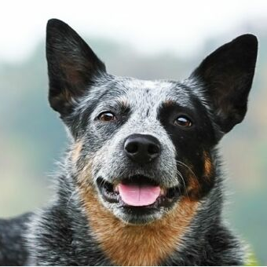
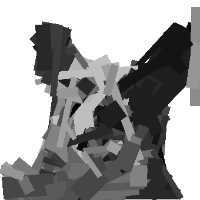
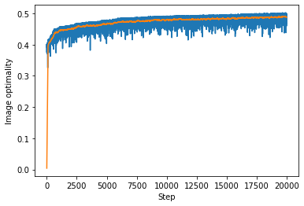
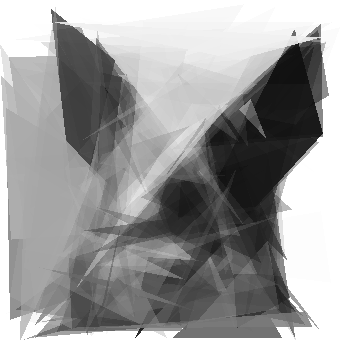
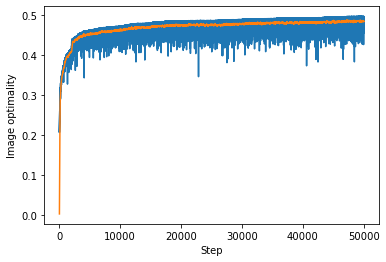

# SUMMARY

This program takes an image as input and uses two different approaches to generate a simpler, geometrical version of it by iterative optimization.

*This is the starting (target) image*

*Approach #1: Simple strokes*

*Approach #2: 128 triangles with transparencies*

I am content with the results, but I think I could substantially improve the program by making changes more gradual (i.e. triangles have a very *unstable* geometry, and small changes in one coordinate can wildly affect the resulting image; I could use disks), and by letting it run for a LONG time (the images I show were generated in 15-30 minutes). All and all, I think the generated images are fascinating. If I ever retake this project, I would like to run it automatically for a number of human faces and/or poses.

# REFERENCES

Conceptually inspired by https://www.reddit.com/r/Python/comments/gn9add/drawing_mona_lisa_with_256_circles_using

(I did not even check the code, even though the OP provided it in their GitHub)
